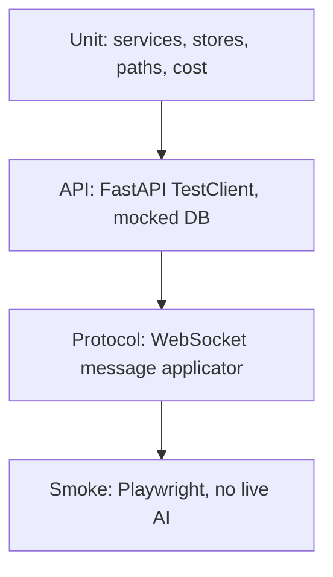

# Test suite strategy (proposal)

**Status:** proposal for review — not implemented.  
**Audience:** project owner / maintainers.  
**Goal:** agree what a good test suite looks like for Clyde before adding tooling or tests.

Clyde is a local-first agent OS. A useful suite tests **invariants of the control plane**, not whether Clyde “thinks correctly.” Live Anthropic, OpenRouter, Gemini, and Telegram loops should stay out of CI.

## Current state

- There are **no tests** in this repo (no pytest, Vitest, or Playwright config).
- The only automated quality gate is `npm run lint` (frontend ESLint).
- [`backend/main.py`](../backend/main.py) is the entire HTTP and WebSocket surface. Its lifespan starts the scheduler, file watcher, Telegram bot, and proactive engine, so importing the app naively is a poor first test target.

## What to test (high ROI)

| Area | Why | Primary code |
|---|---|---|
| Team registry | Source of truth for agents; bootstrap, legacy migration, CRUD, unassigned-team rule, atomic writes, cache invalidation | [`backend/services/registry.py`](../backend/services/registry.py) |
| Settings merge | New keys must appear even if the user's `settings.json` is old | [`backend/services/settings.py`](../backend/services/settings.py) |
| Path sandbox | File API and MCP tools must not escape `WORKING_DIR`. Both `_safe_resolve` and `_safe_path` currently use `str.startswith`, which can false-accept a sibling path such as `/working-evil` | [`backend/main.py`](../backend/main.py), [`backend/agents/tools.py`](../backend/agents/tools.py) |
| Registry migration (pure) | `convert_registry_to_teams` is data transformation; skip the Haiku prompt rewrite | [`backend/services/migration.py`](../backend/services/migration.py) |
| Cost math | Known models compute USD; unknown models return 0 | OpenAI / Gemini / OpenRouter clients under [`backend/services/`](../backend/services/) |
| Schedules & triggers | JSON persistence and CRUD, not “fire a real Clyde session” | [`backend/services/scheduler.py`](../backend/services/scheduler.py), [`backend/services/file_watcher.py`](../backend/services/file_watcher.py) |
| Zustand stores | Already vanilla factories; cheap to unit-test without React | [`frontend/src/stores/`](../frontend/src/stores/) |
| Auto-allow vs registered tools | A new `@tool` must not silently skip the permission UI unless it is explicitly listed | [`_AUTO_ALLOW_TOOLS`](../backend/agents/clyde.py), [`backend/agents/tools.py`](../backend/agents/tools.py) |
| File / schedule REST | Highest-risk HTTP routes once the app can boot without background services | `/api/files*`, `/api/schedules*` |

## What not to put in CI

- Live SDK `send_message` / Deep Agent graphs
- Real embeddings or `match_chat_messages` against hosted Supabase
- Telegram polling
- Prompt quality / self-improvement LLM calls
- Docker-socket agent tools
- The interactive CLI wizard in [`cli/clyde.js`](../cli/clyde.js)

Expensive checks can exist later as a documented local script. They should never be the merge gate.

## Proposed tooling

- **Backend:** pytest + pytest-asyncio, run from `backend/`, with `pythonpath = .` so `services.*` imports work. Tests live in `backend/tests/`. Use `tmp_path` copies of [`working/teams/*.default.json`](../working/teams/teams.default.json) — never the real `working/` tree.
- **Frontend:** Vitest + jsdom in `frontend/` (Next 16 compatible). Co-locate `*.test.ts` next to stores; later `*.test.tsx` for extracted handlers.
- **API:** httpx `AsyncClient` / Starlette TestClient against FastAPI **after** a test lifespan that skips scheduler, watcher, Telegram, proactive engine, and does not construct `ClydeChatManager`.
- **Browser (later):** Playwright against a stubbed backend or fixture WebSocket. One smoke path only.
- **Scripts:** root `npm test` runs backend then frontend. Keep `npm run lint`.
- **CI:** GitHub Actions on PRs — Python 3.11 + Node 20, **no secrets**. Playwright as a later optional job.

## Phased rollout

### Phase 1 — Foundation (recommended first slice)

Near-zero product change except extracting path helpers.

1. Extract one `safe_resolve_under(working_dir, relative)` (e.g. [`backend/services/paths.py`](../backend/services/paths.py)), use it from `main.py` and `tools.py`, and fix the prefix false-positive with `Path.is_relative_to`.
2. pytest coverage:
   - registry bootstrap, load/save round-trip, create / assign / delete team
   - settings defaults for missing keys
   - path traversal (`..`, absolute paths, `/working/` virtual prefix)
   - `convert_registry_to_teams` on a fixture legacy registry
   - `_calculate_cost` for known models and unknown-model → 0
   - auto-allow set vs registered tool names (document intentional permission-gated tools such as `delete_agent` and `update_agent_prompt`)
3. Vitest: chat store append / stream / per-session streaming isolation; task and insight mutations.
4. `npm test` + GitHub Actions.

This pays off immediately and does not require splitting `main.py`.

### Phase 2 — HTTP API without starting the agent OS

[`lifespan`](../backend/main.py) currently always starts background services. Add a test-friendly app factory or `CLYDE_TEST_MODE` lifespan that only mounts routes.

Mock [`services.supabase_client`](../backend/services/supabase_client.py) (or inject a fake) so `/api/sessions`, `/api/tasks`, and `/api/insights` do not hit the network.

Run real filesystem tests against a temp `WORKING_DIR` for `/api/files*` and `/api/schedules*`.

Skip `/ws/chat` in this phase; the handler constructs a chat manager and runs the SDK.

### Phase 3 — Chat protocol as a pure function

[`ChatContainer.tsx`](../frontend/src/components/chat/ChatContainer.tsx) `handleMessage` is a ~700-line switch over the WebSocket protocol in [`useAgentWebSocket.ts`](../frontend/src/hooks/useAgentWebSocket.ts). Extract `applyChatMessage(stores, msg)` (or a reducer) and unit-test:

- `assistant_text` streaming vs new bubble
- `permission_request` / timeout
- `session_created` vs `background_session_created`
- `registry_update`, task events, visualizations

Highest-value frontend test, but it is a refactor of a large component — only after Phase 1 is green.

Optional backend counterpart: a fake `ClydeChatManager` that records `handle_permission_response` and emits canned WebSocket JSON, to test the reader-queue / cancel path in `chat_websocket` without the SDK.

### Phase 4 — Thin browser smoke (optional)

Playwright: app loads, sidebar, settings status dots with mocked `/health` and `/api/registry/settings`, file browser lists the temp working dir. **No send-to-Clyde.** Keep it out of the default PR job until it is stable.

## What “good” looks like

- PR CI is under ~1 minute, no API keys, hermetic.
- A new registry tool missing from `_AUTO_ALLOW_TOOLS` fails a test, or is explicitly allow-listed as “needs permission.”
- Path tests fail if anyone reintroduces `str.startswith` sandboxing.
- Chat UI regressions are caught on protocol fixtures, not by screenshotting a live model.
- Expensive tests (SDK, real DB) are manual or a documented local script, never the merge gate.

## Decisions for the owner

Please confirm or adjust:

1. **First slice** — Phase 1 only (foundation + CI), or Phase 1 + API TestClient in the same pass?
2. **GitHub Actions** — enable on PRs as part of Phase 1?
3. **Path helper extract** — acceptable small production change in Phase 1, or test around the current duplication?
4. **Playwright** — defer until Phase 4 (recommended), or skip entirely for now?

No test files, configs, or CI should be added until this proposal is accepted.
